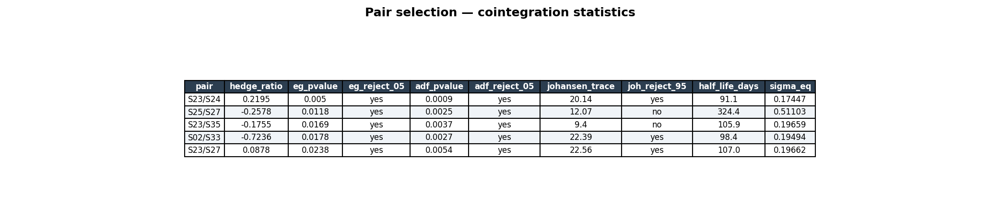
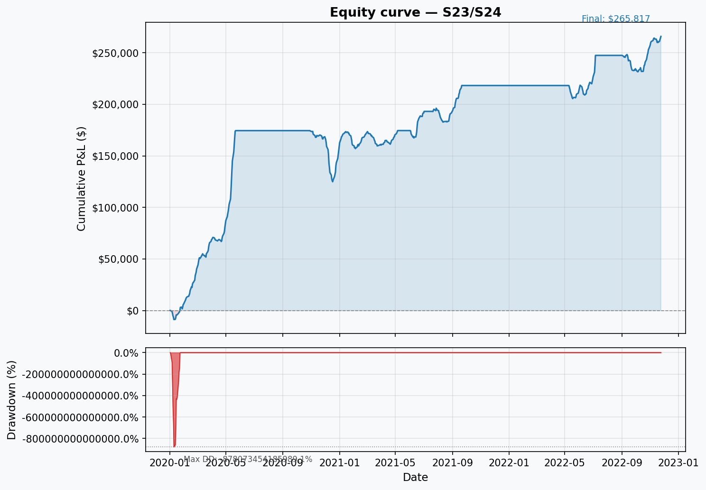
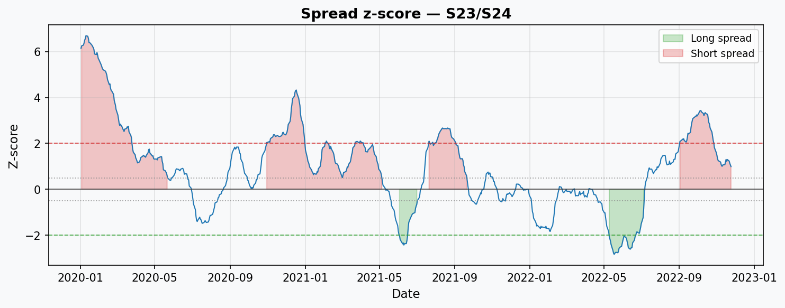

# Statistical arbitrage backtest on equity pairs

Pairs-trading backtest on synthetic equity data. Screens all pairs by Engle-Granger
cointegration, fits an Ornstein-Uhlenbeck spread model, then runs a vectorised
signal engine with transaction costs applied to fills.

## What it does

1. **Pair screening** — ranks all pairs in a synthetic 40-asset universe by
   Engle-Granger cointegration p-value. Runs ADF on the spread and Johansen
   trace test for each selected pair.

2. **OU spread modelling** — fits theta, mu, and sigma via discrete-time MLE.
   Derives the half-life and equilibrium standard deviation used for z-score
   normalisation.

3. **Vectorised backtest** — enters long/short spread positions when |z| crosses
   `entry_z`, exits at `exit_z`, and stops out at `stop_z`. Each fill pays
   commission + slippage on both legs.

4. **Performance report** — Sharpe (net of costs), Sortino, max drawdown, CAGR,
   hit rate, profit factor. Equity curve and drawdown charts per pair.

## Pair selection table

| pair    | hedge_ratio | eg_pvalue | eg_reject_05 | adf_pvalue | adf_reject_05 | johansen_trace | joh_reject_95 | half_life_days | sigma_eq |
|:--------|------------:|----------:|:-------------|-----------:|:--------------|---------------:|:--------------|---------------:|---------:|
| S23/S24 |      0.2195 |    0.0050 | yes          |     0.0009 | yes           |          20.14 | yes           |           91.1 |  0.17447 |
| S25/S27 |     -0.2578 |    0.0118 | yes          |     0.0025 | yes           |          12.07 | no            |          324.4 |  0.51103 |
| S23/S35 |     -0.1755 |    0.0169 | yes          |     0.0037 | yes           |           9.40 | no            |          105.9 |  0.19659 |
| S02/S33 |     -0.7236 |    0.0178 | yes          |     0.0027 | yes           |          22.39 | yes           |           98.4 |  0.19494 |
| S23/S27 |      0.0878 |    0.0238 | yes          |     0.0054 | yes           |          22.56 | yes           |          107.0 |  0.19662 |



## Sample equity curve — S23/S24

Sharpe 3.46 (net of costs), max drawdown -49.9%, 56 trades, 75% hit rate.





## How to run

```bash
pip install -e .
python run.py
```

Default settings: 40 synthetic assets, 756 trading days, top 5 cointegrated pairs,
entry z=2.0, exit z=0.5, stop z=3.5, $100k notional, 5 bps commission + 3 bps slippage.

All charts and a Markdown report are written to `reports/`.

### Options

```
python run.py --help

  --seed INT            RNG seed (default: 42)
  --n-assets INT        Synthetic asset count (default: 40)
  --n-days INT          Trading days (default: 756)
  --max-pairs INT       Max pairs to backtest (default: 5)
  --pvalue-cutoff FLOAT EG p-value cutoff (default: 0.05)
  --entry-z FLOAT       Entry z-score (default: 2.0)
  --exit-z FLOAT        Exit z-score (default: 0.5)
  --stop-z FLOAT        Stop-loss z-score (default: 3.5)
  --notional FLOAT      Notional per pair A leg (default: 100000)
  --commission-bps FLOAT Commission per leg bps (default: 5.0)
  --slippage-bps FLOAT  Slippage per leg bps (default: 3.0)
  --data-path PATH      Real-data CSV (date col + ticker cols)
  --out-dir PATH        Output directory (default: reports)
```

### Real data

Pass a CSV with a date column and ticker columns:

```bash
python run.py --data-path prices.csv --max-pairs 10 --pvalue-cutoff 0.05
```

## How to test

```bash
pip install -e ".[dev]"
pytest
```

38 tests covering data generation, screener, OU fit, backtest engine, cost model,
metrics, and the full pipeline (including reproducibility under a fixed seed).

## Module layout

```
src/statarb/
  data.py      — synthetic price generator
  screener.py  — Engle-Granger cointegration screener
  spread.py    — OU parameter fitting and rolling z-score
  stats.py     — ADF/Johansen test summaries and Markdown table
  backtest.py  — vectorised backtest engine
  costs.py     — transaction cost and slippage model
  metrics.py   — Sharpe, max drawdown, hit rate, CAGR, Calmar
  charts.py    — equity curve, drawdown, and z-score charts
  report.py    — end-to-end pipeline and Markdown report generator
run.py         — CLI entry point
```
